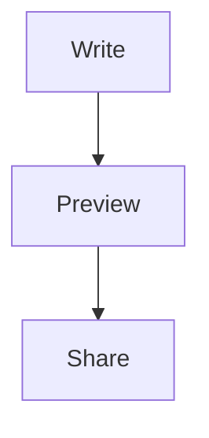

# Wujing

A lightweight Monaco-based editor with code, diff, and Markdown modes.

## Features

- **Code mode** for Monaco's built-in language services, including JavaScript,
  TypeScript, Python, Go, Rust, Java, C/C++, JSON, YAML, SQL, and more.
- **Diff mode** for editing and comparing original and modified content.
- **Markdown mode** with live rendering, edit, split, and preview views, plus
  GitHub-flavored Markdown support for tables, task lists, strikethrough, and
  Mermaid diagrams (use a fenced block labeled `mermaid`).

For example:

````markdown

````

## Development

Install dependencies and start the Next.js development server:

```bash
npm install
npm run dev
```

Open [http://localhost:3000](http://localhost:3000) to use the editor.

## Static export

Run `npm run build` to create the static site in `docs/`. The export is
configured for the repository's GitHub Pages path, `/wujing/`.
The `public/.nojekyll` file ensures GitHub Pages publishes Next.js's `_next`
asset directory instead of filtering it out.

To build and serve the export locally with working root-relative asset URLs, run:

```bash
npm run preview:docs
```

Then open [http://localhost:3000](http://localhost:3000).

## Validation

```bash
npm run lint
npm run build
```
